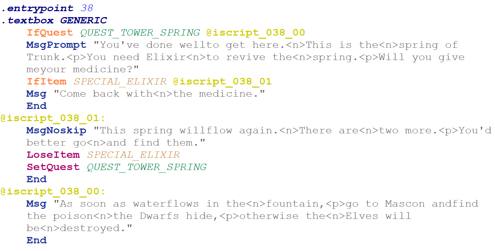

# FaxIScripts - User Documentation

This is the user documentation for FaxIScripts (v0.3), an assembler for the internal scripting language used by Faxanadu for the NES. The application code and binaries can be found on its [GitHub repository](https://github.com/kaimitai/faxiscripts/). It is assumed that users are somewhat acquainted with Faxanadu on the NES.

<hr>

If you want to edit the scripts used within Faxanadu, you will have to do some low level programming - but the language is simple and most scripts used by the game are self-contained and easy to follow.

The scripting layer of Faxanadu consists of text-strings, shop data and code. The shop data and code live together in one section, whereas the strings live in a different section.

A sprite in Faxanadu - an NPC or an item - can call script code. For certain events, like picking up items, dying, trying to open a door with a key and such - the index of the script it triggers is hard coded in the game's logic. For NPCs the sprite data defines which script will be called when you interact with it.

The script code is one contiguos blob of data, and just before the script data begins there is a so called pointer table - with 152 entries - which tells the game where in the script code the entrypoint for the scripts are.

Too see, or edit, which script is connected with a certain NPC in the game, you can use [Echoes of Eolis](https://github.com/kaimitai/faxedit/) - a graphical editor which will let you edit other data portions than the script layer.

<hr>

## Table of Contents

- [Running the assembler](#running-the-assembler)
- [Assembly file contents](#assembly-file-contents)
  - [Defines](#defines)
  - [Strings](#strings)
  - [Shops](#shops)
  - [IScript](#iscript)
    - [Comments](#comments)
    - [Jumps](#jumps)
    - [Labels](#labels)
    - [.entrypoint](#entrypoint-value)
    - [.textbox](#textbox-value)
    - [Opcodes](#opcodes)
- [A concrete example](#a-concrete-example)
- [Editing Tips](#editing-tips)
- [Well-formed code](#well-formed-code)
- [A highly technical note on Quests](#a-highly-technical-note-on-quests)
- [Behind the scenes](#behind-the-scenes)


<hr>

## Running the assembler

The assembler is a command-line tool which can disassemble the scripting layer of a Faxanadu ROM into a human-readable and editable assembly file. It can also read an assembly file and patch the ROM with the information it contains.

The idea is that users will extract the scripting layer to file, make modifications to this file, and then patch the ROM with their changes.

The assembler needs access to a configuration file (eoe_config.xml) in order to use the correct constants for its calculationes. These constants differ by ROM region.

The assembler will report on how much space it used for each data section, and how much more space is available, if any. If we can't fit the data within the limits patching will not take place.

To extract a file, called "Faxanadu (U).nes" say, we run the following command from the command-line:

 ```faxiscripts extract "Faxanadu (U).nes" faxanadu.asm```

 Quotes are only necessary if any of your arguments contain spaces. You can write "x" instead of "extract".

 You can add options when extracting. They are:

* --no-shop-comments (or -p for short): Disable comments showing shop contents where a shop index is used as an operand
* --force (-f for short): Overwrite existing asm-file if it already exists. We don't allow it by default because users might inadvertently overwrite their assembly code if they aren't careful.
* --region (-r for short): Override automatic ROM region deduction. The parameter specified must match a region defined in eoe_config.xml

To build a file we go in the opposite direction, and assemble. To build a file faxanadu.asm and patch "Faxanadu (U).nes" with it, run the following command:

 ```faxiscripts build faxanadu.asm "Faxanadu (U).nes"```

 You can write "b" instead of "build".

 There are also options when building. They are:

 * --original-size (-o for short): This option will make patching fail if we use more ROM data than the original game. Use this if you are already using the free section at the end of the bank for something else. Note that the game code is packed in the code section, so if you add something you will also have to remove something else if you use this mode.
 * --source-rom (-s for short): This option takes an argument, which is a filename for the ROM you will use as a source for patching. If this option is not specified we will patch the file given as output file. Use this if you don't want to patch a ROM file directly.
 --region (-r for short): Override automatic ROM region deduction. The parameter specified must match a region defined in eoe_config.xml

## Assembly file contents

The generated assembly files produce four sections. Defines, required strings, shops and iscript - which is the actual code.

### [defines]

Defines are symbolic constants used by the assembler. The point of them is that instead of remembering the byte value used by items, quests, textbox contexts and ranks - you can use the symbolic string directly in code and the assembler will translate it.

```
[defines]
 ; Item constants
define WEAPON_HAND_DAGGER $00
define WEAPON_LONG_SWORD $01
define WEAPON_GIANT_BLADE $02
```

This is the start of an extracted assembly file. Whenever you use the value WEAPON_GIANT_BLADE for example, as an opcode argument or a shop inventory entry, it will take its value from the defines - so there is no need to memorize all these values.

The defines will only replace numeric constants, and only in the [shops] and [iscript] sections.

### [strings]

The section [reserved_strings] contains a list of strings with reserved indexes. The assembler needs to know about these so they are not relocated or discarded during builds. These are strings which are used directly by game logic, and not necessarily any particular script.

```
[reserved_strings]
3: "This is not<n>enough Golds."
6: "You can't carry<n>any more."
16: "Come here<n>to buy.<n>Come here<n>to sell."
18: "You have<n>nothing to buy."
19: "Which one would<n>like to sell?"
20: "What<n>would you like?"
```
These are the reserved strings in the original game. The strings can be edited, but the indexes should be left as they are.

In general, strings are enclosed by double quotes, and we use special syntax for some characters. Valid characters you can write directly in your strings are:
* A-Z, a-z, 0-9
* . ? ' , ! - _

Then come the special characters we have our own codes for:
* &lt;title&gt;: This character will be replaced with the player's current title
* &lt;p&gt;: Newline and pause. Text output waits until player continues the dialogue.
* &lt;n&gt;: Newline
* &lt;q&gt;: Double quote. We have a special code for this since the string itself is enclosed within double quotes

Then come some glyphs which I am not sure appear in the original game, at least not in dialogue, but we have codes for them:
* &lt;block&gt;: A filled white block
* &lt;long_bar&gt;: A long bar used for arrows
* &lt;short_bar_right&gt;: Ahort bar used by right-pointing arrows
* &lt;arrow_right&gt;: An arrowhead pointing right
* &lt;short_bar_left&gt;: Ahort bar used by left-pointing arrows
* &lt;arrow_left&gt;: An arrowhead pointing left

Any other code can be encoded with &lt;N&gt; where N is a constant value from 0-254, but they are all garbage gfx or duplicates as far as I know. Codes like this will be translated to a byte value directly. 255 cannot be used as it denotes end of string. If you enter any character not in the list above into a string, assembly will fail.

Strings are stored in a certain section of ROM, and we can't extend this section without making game code modifications.

After assembly, strings indexes are given by 1 byte arguments to opcodes using strings, and they are 1-indexed, meaning you can't use more than 254 distinct strings.

Many strings in the game seem to be missing spaces between words, but in those cases they are taking advantage of the fact that line breaks will occurr there, every 16 characters.

Note: You can still give a string index instead of a string to string-using opcodes. The only reasonable use case might be to use string index 0 which seems to be considered an empty string by the game - if you want to add an empty dialogue without consuming a string index.

Note: The above information only applies to non-Japanese ROM regions. The Japanese characters are encoded differently with a textual symbol for each kana and kanji, although we may allow these characters directly in strings in a later version.

### [shops]

This section contains a list of shops, each with an index. This index is given to code instructions which expect a shop reference. In the actual code section the shops and code are mixed together, but we pull them out in this section so they can be edited independently.

```
[shops]
0: (KEY_J 100)
1: (WEAPON_HAND_DAGGER 400) (ITEM_RED_POTION 160) (SPECIAL_ELIXIR 320) (MAGIC_DELUGE 400)
2: (SHIELD_SMALL 800) (WEAPON_HAND_DAGGER 500) (MAGIC_DELUGE 500) (ITEM_RED_POTION 300)
```

This is the beginning of the shops section in the original game data. The symbolic constants will be filled out for you automatically when extracting, so we can immediately see that there is a shop that only sells a Jack Key for 100 golds for example, and this is indeed the Eolis key shop.

The syntax for shops is

**&lt;index&gt;: (item_1 price_1) ... (item_n price_n)**

Each instruction in later code that references a shop needs to be fed one of these indexes. If you add more shops remember to give them unique indexes.

### [iscript]

This is where we edit the actual scripts. We have implemented a custom assembly language tailored to IScript editing, but some terms need to be clear before we begin.

#### comments

Comments can be inserted on a line, starting with a semicolon. Anything from the semicolon to the end of the line will be ignored by the assembler. When we extract scripts from a ROM, we populate comments with shop contents by default - but this is for information only.

#### jumps

When code is executing, it is doing so in a linear fashion, instruction by instruction, unless it meets and end-of-script opcode (defined below) or a jump. A jump is an instruction that tells the program to continue execution in a different location.

#### labels

A label in the assembly file is a target for a jump. When you use a jump instruction in your code, you need to also provide a label that the execution can jump to.

Labels are put on lines in code, and end with a colon, like this:

```@iscript_038_01:```

If an instruction later jumps to label @iscript_038_01 it knows where it is. All labels used in your programs must be defined, and the definitions need to be in unique locations per label. You can use the labels as jump targets anywhere you want however.

Labels can have any name, but they are case-sensitive. When extracting from ROM labels will be automatically generated for you, but it is a good idea to give your labels descriptive names. I personally like to start labels with @ so they pop out in the code.

Remember:
* When defining a label it ends with a colon. It is only defined once.
* When referencing a label to redirect execution flow from somewhere else, don't add the colon.

#### .entrypoint &lt;value&gt;

The entrypoint directive tells the assembler where each script will enter the code and start executing. After compilation the linker will resolve this address to an actual value. The important thing is that all 152 pointer table entries are known at linking time, so ensure you have 152 entrypoints, from 0 to 151, in your code. Several entrypoints can be at the same location - that just means several script indexes will run the same script - and in the original game there are lots of such cases.

#### .textbox &lt;value&gt;

The .textbox directive must follow immediately after an entrypoint, and takes one argument. It determines which textbox will be used for the script. This emits one byte, so we can think of it as a pseudo-opcode - so if it is missing the code exectution will be unaligned with the instruction offsets and probably crash.

We are providing the constants you can use as arguments. GENERIC is a textbox with no portrait, whereas the others - like GURU and NURSE - have portraits.

#### opcodes

Once we are past the entrypoint and have set up the textbox context, we are ready to run regular opcodes. Each opcode has a mnemonic, and an optional list of arguments and a jump target. All available opcodes are as follows:

| Opcode       | Arguments      | Jump/Read Addr | Description |
|--------------|----------------|-----------|-------------|
| End          | —              | —         | Ends the script |
| MsgNoskip    | string   | —         | Shows unskippable message |
| MsgPrompt    | string   | —         | Shows prompt message. Ends script if cancelled, continues otherwise |
| Msg          | string   | —         | Shows skippable message, script ends if skipped |
| IfTitleChange| —              | label     | Jumps to label if eligible for title change |
| LoseGold     | integer        | —         | Deducts gold from the player if he has enough gold, otherwise shows the "not enough gold"-message  |
| SetSpawn     | spawn point    | —         | Sets spawn point (0–7) |
| GetItem      | item id        | —         | Gives item to player |
| OpenShopBuy  | —              | shop index| Opens shop in buy-context |
| GetGold      | integer        | —         | Gives gold to player |
| GetMana      | byte integer   | —         | Gives mana to player |
| IfQuest      | quest id       | label     | Jumps if quest completed |
| IfRank       | rank id        | label     | Jumps if rank is sufficient |
| IfGold       | —              | label     | Jumps if player has any gold |
| SetQuest     | quest id       | —         | Marks quest as complete |
| IfBuy        | —              | label     | Jumps if player chooses "buy" |
| LoseItem     | item id        | —         | Removes item from player |
| OpenShopSell | —              | shop index| Opens shop in sell-context |
| IfItem       | item id        | label     | Jumps if player has item |
| GetHealth    | byte integer   | —         | Gives health to player |
| ShowMantra   | —              | —         | Shows mantra |
| EndGame      | —              | —         | Ends the game immediately |
| IfMsgPrompt  | string | label     | Shows prompt and jumps if accepted |
| Jump         | —              | label     | Unconditional jump |

Byte integers take values from 0 to 255, and other integers take values from 0-32767. Other IDs are byte values too, but you can replace the values with define constants in your code.

All opcodes starting with If will take a label as the last argument. The only exception is Jump, which redirects execution no matter what.

The assembler will fail if you give the wrong number of arguments to your opcodes.

Unlike labels and defines, opcodes are not case sensitive; you can write ENDGAME, endgame or EndGame for example - whichever you prefer.

## A concrete example

It will be clearer once we look at a script and inspect it. Here is the script for the dialogue with the wise old man in Tower of Fortress who wants an elixir to open the fountain. We have taken a screenshot from the script in Notepad++ with syntax highliting.



We see that the entrypoint is 38, meaning the script ID associated with this sprite is 38. We also see that the textbox context is GENERIC, meaning there is no portrait.

The first line in the code is

```IfQuest QUEST_TOWER_SPRING @iscript_038_00```

This line says, if quest QUEST_TOWER_SPRING (the value of which is defined in the defines-seciton) is completed, execution jumps to label @iscript_038_00.

If the quest is not complete it continues without jumping, and then the next instruction would be:

```MsgPrompt "You've done wellto get here.<n>This is the<n>spring of Trunk.<p>You need Elixir<n>to revive the<n>spring.<p>Will you give meyour medicine?"```

which displays message with a string and prompts the user. If the user cancels the script terminates, but if the user accepts, the following instruction is run:

```IfItem SPECIAL_ELIXIR @iscript_038_01```

This says that if the player has the elixir, we jump to label @iscript_038_01.

Otherwise execution continues with another Msg-opcode, displaying message "Come back with&lt;n&gt;the medicine.". Then the script ends.

If we backtrack and see what happens if the player has the elixir when he accepts, then we jumped to label iscript_038_01.

Here this block is executed:

```
    MsgNoskip "This spring willflow again.<n>There are<n>two more.<p>You'd better go<n>and find them."
    LoseItem SPECIAL_ELIXIR
    SetQuest QUEST_TOWER_SPRING
    End
```

The wise man says the spring will flow again, then the player loses the elixir, and the quest flag for this spring is set. Then the script ends.

If go back to the beginning and see what had happened at the initial check, when we jump to @iscript_038_00 if the quest is complete already.

The block of code at label @iscript_038_00 is:

```
    Msg "As soon as waterflows in the<n>fountain,<p>go to Mascon andfind the poison<n>the Dwarfs hide,<p>otherwise the<n>Elves will be<n>destroyed."
    End
```
So if we talk to him after already finishing the quest, we get another message before the script ends.

As a flowchart the logic looks like this:

```text
.entrypoint 38
.textbox GENERIC
     |
     v
+----------------------+
| Is QUEST_TOWER       |
| SPRING completed?    |
+----------------------+-------+
     | Yes                     | No
     v                         v
+------------------+     +-----------------------------+
| Mag "As soon  |     | MsgPrompt                |
| "as water flows" |     | "Will you give me medicine?"|
| End              |     +-----------------------------+
+------------------+      | Accept             Decline |
                          v                            v
                +--------------------------+      Implicit End
                | Check for SPECIAL_ELIXIR |
                +--------------------------+
                    | Present       | Absent
                    v               v
          +------------------+   +------------------+
          | MsgNoskip        |   | Msg              |
          | "This spring     |   | "Come back..."   |
          | will flow        |   | End              |
          | again"           |   +------------------+
          | Lose Elixir      |
          | Set QuestComplete| 
          | End              |
          +------------------+
```


This was a script with several branches. Most scripts in the game are simple scripts with one message and then a script end, but you can make some logic and branching like this around quests and held items.

### Editing Tips

The easiest way to understand how scripting works is to see the scripts from the original game in an assembly file and trying to modify them.

Extract a ROM to an asm file, and change the following under .entrypoint 0 (there are many entrypoints here in the same location):

```
.textbox GENERIC
    MsgNoskip "I've been on<n>a long journey.<p>I came back to<n>my home town<n>to find it is<n>almost deserted.<p>The gate is<n>closed,<n>people are gone,<p>and the walls<n>are crumbling.<p>I wonder<n>what happened."
    End
```

This is the script that is called when you start the game and hit the invisible trigger. You can start by changing this script to things like:

```
.textbox PINK_SHIRT
    MsgNoskip "Hello"
    GetGold 1000
    GetHealth 50
    GetItem WEAPON_DRAGON_SLAYER
    End
```

Then assemble your file back to ROM and confirm that you get the expected results. The example above makes the Pink Shirt Guy show up in a portrait and say "Hello" and you get 1000 golds, 50 health, and you get the dragon slayer.

Use a text editor with support for assembly markup. I personally use [Notepad++](https://notepad-plus-plus.org/) which is open source and the default asm-markup helps. We have made a [user-defined syntax highlighter](./../util/FaxIScript.xml) you can import to Notepad++ to help with IScript coding.

Notepad++ supports autocomplete which is helpful too, so you can get your defines easily without going back to look them up.

Use comments and descriptive labels when coding to remember what you were working on when you come back to your code.

## Well-formed code

For an asm-file to be valid, you need to specify all 152 entrypoints, and for each entrypoint the first instruction (or pseudo-instruction in this case) must be a textbox.

After that you need to make sure that we never hit another textbox while the code is executing, and that all possible branches execution flow can take ultimately end with the End-opcode (or EndGame). After assembly, the application will try to re-parse your code by entering at each entry point and simulate execution for all possible branches. If this fails, your ROM will not be patched and you need to fix your asm-file.

Check:

* 152 distinct entrypoints numbered 0-151
* Each entrypoint is followed by a .textbox before any opcode
* Code execution terminates in all branches it could possibly take, and it never hits another .textbox
* All your code can actually be reached from an entrypoint. Unreachable code can not survive a round trip from asm to ROM and back to asm - the parser only looks for code the game could potentially reach.


### A highly technical note on Quests

The game holds one byte in RAM which stores information on whether a quest is complete, with eight entries - one entry per bit. These are flags that tell the game whether the 3 springs have been opened, whether you have opened the path to Mascon, whether you have gotten the Mattock from the Wyvern and whether you have gotten the Wing Boots from the stone dropper. The other two bits do not seem to be used.

When we use opcode IfQuest and SetQuest, the number we give as input is not a bitmask to be compared with the quest byte, for some reason. In actuality the number we pass in to the function is used as an index into a lookup table hard coded in the game logic, and this lookup table has 3 entries - in the game's script code only the three springs are checked. Other quest flags are queried directly within the game code itself. Each entry is a power of two; 1, 2 and 4 - and this is finally used as a bitmask in comparisons with the quest byte in RAM.

The area in ROM where this 3-byte lookup table is stored is in the middle of the action handler code used by the scripting engine. One thing we did to get more state branching into our code, was to scan the 255 bytes forward from the quest lookup table and see if we could find more perfect powers of two, and in fact there were two of them. Then we looked to see if there was any byte value which did not have overlapping bits turned on for any of the 5 quest flag indexes we had found, and there were three such values. We used one of them, called it QUEST_EXTRA, and let it represent a sixth unique state. QUEST_EXTRA will set more than one quest flag, but they will not overlap any of the 5 "clean quest flags" so it can be used independently.

You can extend this exploitation of going out of the original bounds of the lookup table even further; you can map all distinct values in the "extended lookup table" and use them as bitmasks where the value will be used as an OR when passed to IfQuest, and as an AND when passed to SetQuest, effectively querying or setting multiple quest flags at once.

### Behind the scenes

I started work on this assembler a few days after releasing Echoes of Eolis. The format is entirely mapped out in [Chipx86's Faxanadu disassembly](https://chipx86.com/faxanadu/) so we could parse the data almost immediately.

The problem I wrestled with was how to structure my data, and how to present it for editing. I had three requirements I wanted to fulfill:

* Modularize the scripts - that is turn each script we read from each entrypoint into a discrete object
* Be able to parse any valid script code from ROM and write functionally equivalent code back when patching
* Not emitting more bytes than I read in

It turns out it is almost impossible to fulfill all three. I suppose it can technically be done, but it would require us to identify all shared code and insert unconditional jumps wherever it could save us bytes - in other words code tail deduplication. When there is no limit to how the code can jump and loop, we decided to go forego modularization, and decided to just present the code as it is in the ROM - as assembly code.

We move the shop data and treat it separately, as that is an abstraction we can get for free.

The other problem I had to tackle was overflowing into an unsafe ROM region. The script code in the original game is completely packed between the pointer table and unrelated data, so we had to make use of free space near the end of the ROM bank if people want to add code without at the same time removing any.

In an intermediary stage we decided to let the shop data live in original safe region 1, and let the script code start in the safe region 2. This was not incredibly hard to implement since our instruction stream became contiguous, but we did waste bytes because we left a lot of unused data in safe region 1.

For that reason we decided to let the code stream start in region 1 and be redirected to region 2 if it overflowed. This is what I refer to as smart static linking.

What it does, is as follows:

* If we overflow, find the last instruction that is completely contained in region 1
* Go backward, starting from this instruction, until a stream-ending opcode is found (End, EndGame or Jump)
* Change the instruction byte offsets for all instructions after this End or Jump, by adding the necessary delta that makes the first relocated instruction start in region 2.
* Go back and patch all pointer table entries, jump targets and so on which reference relocated instructions.

This was not trivial to get right before I made the decision to link pointer table entries and labels to instruction indexes while parsing, rather than to byte offsets directly. After the relocation - and only after all instruction byte offsets have been completely resolved - we go back and assign byte offsets to pointers and references by querying the offset of the instruction it points to.

To squeeze out even more bytes here you can insert an unconditional jump to bridge the code stream at the very last moment you overflow (but only if the last safe instruction is not already stream-ending) but you need to ensure that the jump itself completely fits in the region - and now all reference indexes after the jump shift by one. It is perfectly doable, but I opted not to do it since it will change the assembly code of the user - but we might make this optional in a future release.
