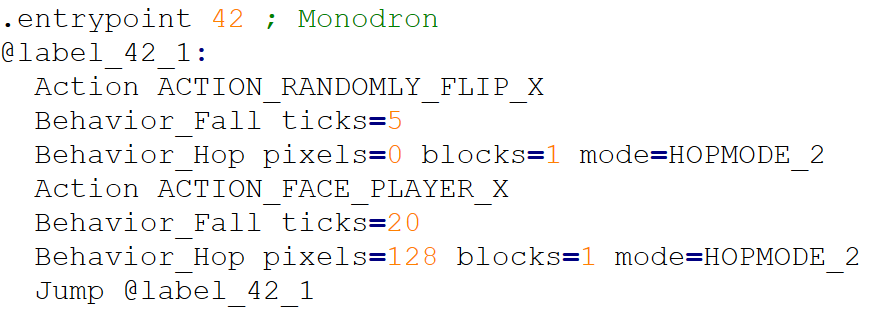
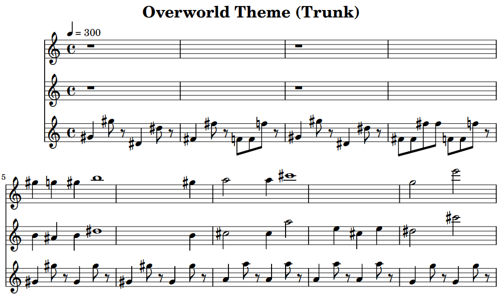

# FaxIScripts - Assembler and Disassembler for scripting in Faxanadu (NES)

Welcome to the FaxIScripts code repository and release page. The code is standard C++20, and the project files were created using Microsoft Visual Studio Community 2022. You can compile the application from source, or get the latest precompiled Windows x64 build under the [repository releases](https://github.com/kaimitai/FaxIScripts/releases/).

This tool is used for extracting data from Faxanadu (NES) ROMs - scripts and music - which can be edited in text editors and injected back into the ROM.

The aim of this assembler is to extract script code to human-readable formats reminiscent of assembly code. We aim to stay at the highest possible layer of abstraction without losing any extracted information.

Make sure to read the [documentation](./docs/faxiscripts_doc.md) for a detailed overview of the syntax and structure of the assembly files we will be editing, as well as a list of all available opcodes.

<hr>

**The interaction script (iScript) layer**

Interaction scripts are used for several things; interacting with NPCs and shops - and some scripts are called on certain events - like dying and picking up or using items.

This scripting layer contains strings, shop data and actual code. The strings are stored in a separate section, but the shop data and code live together in one combined section. The shop data gets moved to its own section in our assembly files, and any opcode referencing a shop uses its index - which is only resolved to an actual address during linking. This provides a zero-cost abstraction - no extra bytes, no layout penalties.

There are two ROM sections we can use when patching, and users can choose between different patching modes.

An example of an extracted iScript:


#### Faxanadu iScript #67 - Free full plate from a man in the Victim pub, if your rank is Soldier or higher

<hr>

**The behavior script (bScript) layer**

This layer contains the scripts which define sprite behavior - for both NPCs, enemies and items. There are 101 entries, one for each sprite in the game.

Here too, there are two ROM sections we can use when patching, and the users can choose between different patching modes.



#### Faxanadu bScript #42 - Monodron behavior

<hr>

**The music (mScript) layer**

We also support extracting and patching the music layer of Faxanadu - both at the assembly level, and at a higher level of abstraction - as MML (music macro language) files.

For MML editing there is a separate [documentation](./docs/faxiscripts_mml.md) for a detailed overview of the syntax and structure of the file format - as well as the necessary technical information needed to compose music effectively.

The assembly format is provided for completeness' sake, and because the MML compiler needs it. For actual music composition we recommend using MML over mScript assembly.


An example of the beginning of an extracted tune:



<hr>

This application has a natural companion in [Echoes of Eolis](https://github.com/kaimitai/faxedit/), which is a graphical editor that can patch the other dynamically sized data portions in Faxanadu. To see, or change, which NPCs in Faxanadu are connected to a given interactions script, for example, Echoes of Eolis can can be used.

<hr>

## Assembler Capabilities
The assembler has the following features:

* Byte-fidelity with respect to size and functionality will be retained when extracting and patching content; for both strings, shops, music and script code. There is no change to game code itself, just a clean patching of dynamically sized data.
* When extracting an assembly file from ROM, the constant defines will be populated automatically and used in the code
* For iScripts, strings will be inlined in the code and can be used as operands directly. The assembler will discard all duplicates and ensure that all string-calling functions point to the correct index. Reserved string indexes (six strings which are used by index directly from the action handlers, even if no scripts reference them) are defined in the asm automatically when extracting, and the assembler will not consider these for re-indexing or discarding.
* Extracted iScript asm-files can show shop contents as comments wherever they are used as operands
* Strict-mode; where we don't patch a ROM if we spend more bytes than the original ROM did, tightly packed in one section (applies to iScripts and bScripts)
* For iScripts and bScripts, we provide a smart static linker; The shop data and code stream starts within the first safe region, and if we overflow the static linker redirects code to the second region while patching all required labels, jumps, pointer table entries and instruction offsets. This is done without inserting a synthetic jump-node. bScripts too can be extended in this way with a tail end code relocation, although it is in its entirety a code section.
* Automatic ROM region deduction, ensuring that the assembly code is extracted from, and injected to, the correct ROM locations.

<hr>

## How it works

The application can disassemble - that is extract - the scripting or music layer data into text files - from a Faxanadu NES rom. These files can then be modified by the user via our internal assembly languages.

A command-line instruction will extract and disassemble the scripting layer data from ROM.

The command `faxiscripts x "Faxanadu (U).nes" faxanadu.asm` will extract the interaction script data from file "Faxanadu (U).nes" and write it to file faxanadu.asm.

Another instruction will pack your data and assemble your code, and patch it back to ROM.

Using the command ```xb``` instead of ```x``` will extract behavior scripts instead.

The command `faxiscripts b faxanadu.asm "Faxanadu (U).nes"` will patch "Faxanadu (U).nes" with the interaction script code from faxanadu.asm as long as the code was valid.

Using the command ```bb``` instead of ```b``` will assemble behavior scripts instead.

The asm-files may look a little daunting at first, but I am sure it will be very manageable for most people who have an interest in editing scripts. The documentation is detailed and contains concrete examples you can follow.

There is little static code analysis available for the time being, but before actually patching the ROM we ensure the code is good by trying to traverse all code paths from all entry points to verify that the code the game can potentially use can actually be parsed.

The command `faxiscripts xmml "Faxanadu (U).nes" faxanadu.mml` will extract the music layer from file "Faxanadu (U).nes" and write it to file faxanadu.mml.

Another instruction will pack your music, and patch it back to ROM.

The command `faxiscripts bmml faxanadu.mml "Faxanadu (U).nes"` will patch "Faxanadu (U).nes" with the music from faxanadu.mml.

We also have commands for rendering Faxanadu music as midi files, both directly from ROM or from an MML file. In addition to that, we can export MML files, or music directly from ROM, to the [LilyPond](https://lilypond.org/) format, which can provide musical scores.

<hr>

### Roadmap

We prioritize fixing bugs if any are discovered, but here are some ideas for future features:

* We might do more static analysis to help users identify problems in their code
* Add an option to let the linker insert a jump-instruction to bridge the gap between the safe ROM regions for iScripts and bScripts. This could potentially save some bytes over the current bridging strategy.
* Allow Japanese characters directly in strings for the jp region
* Emit more statistics from MML compilation; like for example total fractional drift (if any) and byte size per channel.
* Allow adding new iScripts beyond the original count of 152, if possible. Requires patching a pointer-to-pointer, but needs to be investigated.
* Create Notepad++ syntax highlighting definition files for bScripts, mScripts and MML

<hr>

### Version History

* 2026-02-04: version 0.6
    * Added support for behavior script extraction and patching. The assembler now handles all three script types!
    * Improved the [MML (music macro language) documentation](./docs/faxiscripts_mml.md) and added example MMLs graciously provided by [Jessica](https://www.romhacking.net/community/9037/)

* 2026-01-18: version 0.51
    * Added support for exporting music from MML files, or music directly from ROM, to the [LilyPond](https://lilypond.org/) format. This can be used to engrave your music and provides an alternative way to convert music to midi. Some new directives were added to the MML format so that composers can set time signatures for their songs, or set clefs per channel, in the LilyPond output. There is also an option for adding a drum staff for the percussion channel.
    * Fixed a subtle bug where the MML bytecode generator would emit two set-length commands in a row.

* 2026-01-12: version 0.5
    * Added support for extracting Faxanadu's music layer as MML files, which raises the level of abstraction and makes music editing easier for composers.
    * Added support for using binary constants in iScripts. Prefix binary constants with 0b or % - for example 0b00100110.

* 2025-12-20: version 0.4
    * Added support for extracting the music layer as an assembly file in the context of Faxanadu's music engine (mScripts). 

* 2025-11-22: version 0.3
    * Added configuration xml file with necessary constants for the major ROM regions as well as for two ROM hacks. This configuration file is also compatible with [Echoes of Eolis](https://github.com/kaimitai/faxedit/).
    * Added command-line option (-r) for overriding the automatic ROM region deduction

* 2025-11-13: version 0.2
    * Use inline strings for both disassembly and assembly. The assembler will deduplicate all strings in the code, and allocate string indexes automatically during builds. Reserved strings will retain their indexes
    * A consequence of the assembler allocating strings is that unused strings (strings not referenced in code and reserved strings) will be discarded. In the original game data we save 460 bytes by deduplicating strings and discarding unreferenced ones
    * Include [IScript syntax highlighting for Notepad++](./util/FaxIScript.xml), in a new util-folder
    * Opcode EndGame will be treated as end-of-stream
    * Added better error messages in places
    * Removed "extended ROM mode" as it had no reasonable use case

* 2025-11-09: version 0.1
  * Initial release

<hr>

### Credits

Special thanks to [ChipX86/Christian Hammond](http://chipx86.com/) - For entirely mapping out the scripting languages and the music engine in his [Faxanadu disassembly](https://chipx86.com/faxanadu/) - and for coining the terms iScript, bScript and mScript. This project would not have existed without his resources.

<hr>

You can also find me on the **Faxanadu Randomizer & Romhacking** Discord server, the main hub for all things Faxanadu.

[](https://discord.gg/K65uxXhA)
