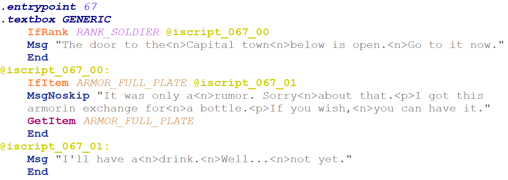

# FaxIScripts - Assembler and Disassembler for scripting in Faxanadu (NES)

Welcome to the FaxIScripts code repository and release page. The code is standard C++20, and the project files were created using Microsoft Visual Studio Community 2022. You can compile the application from source, or get the latest precompiled Windows x64 build under the [repository releases](https://github.com/kaimitai/FaxIScripts/releases/).

IScripts are scripts used inside the Faxanadu (NES) game engine, and are surprisingly expressive. The aim of this assembler is to extract IScript code to a human-readable format reminiscent of assembly code. We aim to stay at the highest possible layer of abstraction without losing any extracted information.

The scripting layer contains strings, shop data and actual code. The strings are stored in a separate section, but the shop data and code live together in one combined section. The shop data gets moved to its own section in our assembly files, and any opcode referencing a shop uses its index - which is only resolved to an actual address during linking. This provides a zero-cost abstraction - no extra bytes, no layout penalties.

There are two ROM sections we can use when patching, and the users can choose between different patching modes.

We also support extracting and patching the music layer of Faxanadu at the assembly level. This is functional, but it is tedious to make music by editing music asm-files. It is good for experimentation, however, and is necessary scaffolding once we raise the level of abstraction.

Make sure to read the [documentation](./docs/faxiscripts_doc.md) for a detailed overview of the syntax and structure of the assembly files we will be editing, as well as a list of all available opcodes.

This application has a natural companion in [Echoes of Eolis](https://github.com/kaimitai/faxedit/), which is a graphical editor that can patch the other dynamically sized data portions in Faxanadu. To see, or change, which NPCs in Faxanadu are connected to a given script (script entrypoint) this editor can be used.

An example of an extracted script:

#### Faxanadu script #67 - Free full plate from a man in the Victim pub, if your rank is Solider or higher

## Assembler Capabilities
The assembler has the following features:

* Byte-fidelity with respect to size and functionality will be retained when extracting and patching content; for both strings and script code. There is no change to game code itself, just a clean patching of dynamically sized data.
* When extracting an asm-file from ROM, the constant defines will be populated automatically and used in the code
* Strings will be inlined in the code and can be used as operands directly. The assembler will discard all duplicates and ensure that all string-calling functions point to the correct index. Reserved string indexes (six strings which are used by index directly from the action handlers, even if no scripts reference them) are defined in the asm automatically when extracting, and the assembler will not consider these for re-indexing or discarding.
* Extracted asm-files can show shop contents as comments wherever they are used as operands
* Strict-mode; where we don't patch a ROM if we spend more bytes than the original ROM did, tightly packed in one section
* Smart static linker mode; The shop data and code stream starts within the first safe region, and if we overflow the static linker redirects code to the second region while patching all required labels, jumps, pointer table entries and instruction offsets. This is done without inserting a synthetic jump-node.
* Automatic ROM region deduction, ensuring that the assembly code is extracted from, and injected to, the correct ROM locations.

## How it works

The application can disassemble - that is extract - the scripting layer data in one assembly-file - from a Faxanadu NES rom. This file can then be modified by the user via our internal assembly language.

A command-line instruction will extract and disassemble the scripting layer data from ROM.

The command `faxiscripts extract "Faxanadu (U).nes" faxanadu.asm` will extract this data from file "Faxanadu (U).nes" and write it to file faxanadu.asm.

Another instruction will pack your data and assemble your code, and patch it back to ROM.

The command `faxiscripts build faxanadu.asm "Faxanadu (U).nes"` will patch "Faxanadu (U).nes" with the code from faxanadu.asm as long as the code was valid.

The asm-files may look a little daunting at first, but I am sure it will be very manageable for most people who have an interest in editing IScripts. The documentation is detailed and contains concrete examples you can follow.

There is little static code analysis available for the time being, but before actually patching the ROM we ensure the code is good by trying to traverse all code paths from all entry points to verify that the code the game can potentially use can actually be parsed.

The command `faxiscripts xm "Faxanadu (U).nes" faxanadu.masm` will extract the music layer from file "Faxanadu (U).nes" and write it to file faxanadu.masm.

Another instruction will pack your music, and patch it back to ROM.

The command `faxiscripts bm faxanadu.masm "Faxanadu (U).nes"` will patch "Faxanadu (U).nes" with the music from faxanadu.masm.

### Roadmap

We prioritize fixing bugs if any are discovered, but here are some ideas for future features:

* Allow music exports and imports at a higher level of abstraction, once we know enough to decide what the abstraction should look like. Most likely a music macro language (mml) of some sort.
* We might do more static analysis to help users identify problems in their code
* Add an option to let the linker insert a jump-instruction to bridge the gap between the safe ROM regions. This could potentially save some bytes over the current bridging strategy.
* Allow Japanese characters directly in strings for the jp region

### Version History

* 2025-11-22: version 0.4
    * Added support for extracting the music layer as an assembly file in the context of Faxanadu's music engine (mScripts). 

* 2025-11-22: version 0.3
    * Added configuration xml file with necessary constants for the major ROM regions as well as for two ROM hacks. This configuration file is also compatible with [Echoes of Eolis](https://github.com/kaimitai/faxedit/).
    * Added command-line option (-r) for overriding the automatic ROM region deduction

* 2025-11-13: version 0.2
    * Use inline strings for both disassembly and assembly. The assembler will deduplicate all strings in the code, and allocate string indexes automatically during builds. Reserved strings will retain their indexes
    * A consequence of the assembler allocating strings is that unused strings (strings not referenced in code and reserved strings) will be discarded. In the original game data we save 460 bytes by deduplicating strings and discarding unreferenced ones
    * Include [IScript syntax highlighting for Notepad++](./util/FaxIScript.xml), in a new util-folder
    * Opcode EndGame will be treated as end-of-stream
    * Added better error messages in places
    * Removed "extended ROM mode" as it had no reasonable use case

* 2025-11-09: version 0.1
  * Initial release

### Credits

Special thanks to the following contributors and fellow digital archaeologists:

[ChipX86/Christian Hammond](http://chipx86.com/) - For entirely mapping out the IScript language in his [Faxanadu disassembly](https://chipx86.com/faxanadu/) - and for coining the term IScript (Interaction Script) itself. This project would not have existed without his resources.
