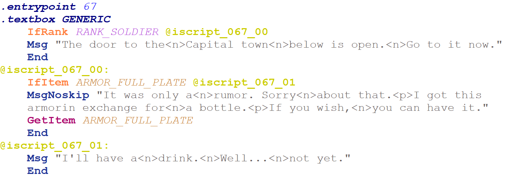
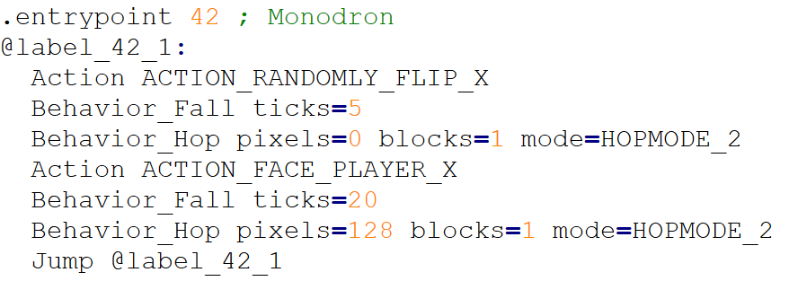
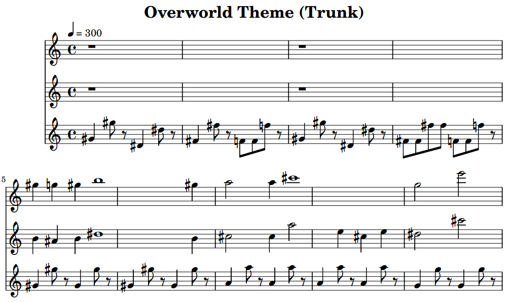

# FaxIScripts - Assembler and Disassembler for Faxanadu (NES)

Welcome to the FaxIScripts code repository and release page.

FaxIScripts is a command-line assembler and disassembler for Faxanadu. It supports extracting scripts, music, and miscellaneous game data from ROM files into human-readable text formats, allowing users to edit the data and inject it back into the game.

The assembler aims to provide the highest practical level of abstraction while preserving all information present in the original data. Extracted scripts resemble assembly language, while music can be edited either as assembly or as MML (Music Macro Language).

Precompiled Windows x64 builds are available on the [repository releases](https://github.com/kaimitai/FaxIScripts/releases/) page. The project can also be built from source on Windows, Linux, and macOS using CMake.

The application supports all major Faxanadu ROM regions, including US, US Revision A, EU, JP, and the [English Translation Hack](https://www.romhacking.net/translations/4281/).

FaxIScripts has a natural companion in [Echoes of Eolis](https://github.com/kaimitai/faxedit/), a graphical editor capable of modifying many of the dynamically-sized game data structures that are not handled through the assembler.

See the [documentation](./docs/faxiscripts_doc.md) for a detailed overview of the supported formats, assembly syntax, available opcodes, and command-line options.

See the [changelog](./docs/faxiscripts_doc.md#changelog) for version history.

<hr>

## Quick Links

* [Documentation](./docs/faxiscripts_doc.md)
* [MML Documentation](./docs/faxiscripts_mml.md)
* [Changelog](./docs/faxiscripts_doc.md#changelog)
* [Building from Source](#building-from-source)
* [Interaction Scripts (iScripts)](#interaction-scripts-iscripts)
* [Behavior Scripts (bScripts)](#behavior-scripts-bscripts)
* [Music Scripts (mScripts)](#music-scripts-mscripts)
* [Miscellaneous Data](#miscellaneous-data)
* [Quick Start](#quick-start)
* [Assembler Capabilities](#assembler-capabilities)
* [Credits](#credits)
* [Community & Related Projects](#community--related-projects)

<hr>

## Building from Source

FaxIScripts has no external dependencies and can be built using any standard C++20 compiler together with CMake and Ninja.

### Linux

Install the required packages:

```bash
sudo apt update
sudo apt install build-essential cmake ninja-build
```

From the repository root:

```bash
mkdir build
cd build

cmake .. -G Ninja -DCMAKE_BUILD_TYPE=Release
ninja
```

### macOS

Install the required dependencies:

```bash
brew install cmake ninja
```

From the repository root:

```bash
mkdir build
cd build

cmake .. -G Ninja -DCMAKE_BUILD_TYPE=Release
ninja
```

**Note:** `eoe_config.xml` must be located in the same directory as the executable when loading ROM files.

<hr>

## Interaction Scripts (iScripts)

Interaction scripts control NPC conversations, shops, item usage and other game interactions.

The assembler extracts these scripts into a human-readable assembly-like format while preserving all information from the original ROM. Strings, shop data, and script code are presented in a form that is easier to edit and maintain than their original binary representation.

Users may freely modify script logic, dialogue, and shop contents before assembling the data back into the ROM.

An example of an extracted iScript:



#### Faxanadu interaction script #67 - A villager in the Victim pub gives the player a Full Plate if their rank is Soldier or higher

<hr>

## Behavior Scripts (bScripts)

Behavior scripts define how sprites behave in the game, including NPCs, enemies, items, and other interactive objects. Faxanadu contains 101 behavior scripts, one for each sprite type.

The assembler extracts these scripts into a human-readable assembly-like format that can be modified and assembled back into the ROM. This allows users to customize enemy AI, NPC behavior, item interactions, and other gameplay mechanics.



#### Faxanadu behavior script #42 - Monodron behavior

<hr>

## Music Scripts (mScripts)

FaxIScripts supports extracting and patching the music layer of Faxanadu, both as assembly and as MML (Music Macro Language).

For music composition, we strongly recommend using MML. The separate [MML documentation](./docs/faxiscripts_mml.md) describes the syntax, structure, and technical details required to compose music effectively.

The assembly representation is provided for completeness and as an intermediate format used by the MML compiler, but most users will find MML significantly easier to work with.

An example of the beginning of an extracted tune:



<hr>

## Miscellaneous Data

In addition to scripts and music, FaxIScripts can extract various game data into a human-readable text format that can be edited and re-injected into the ROM.

This mode can be used to modify strings, enemy parameters, weapon statistics, magic data, and other gameplay-related values. The format is region-agnostic and abstracts away ROM-specific details such as differing character encodings and text palettes, making it a practical alternative to manual hex editing.

FaxIScripts also includes a mantra mode capable of encoding and decoding mantra strings, including support for ROM hacks with custom spawn point configurations.

<hr>

## Quick Start

FaxIScripts extracts game data from a Faxanadu ROM into human-readable text formats, allowing you to edit the data and assemble it back into the ROM.

### Interaction Scripts (iScripts)

Extract interaction scripts:

```bash
faxiscripts x "Faxanadu (U).nes" faxanadu.asm
```

Assemble and patch interaction scripts:

```bash
faxiscripts b faxanadu.asm "Faxanadu (U).nes"
```

Use `xb` and `bb` instead of `x` and `b` for behavior scripts (bScripts).

### Music (MML)

Extract music:

```bash
faxiscripts xmml "Faxanadu (U).nes" faxanadu.mml
```

Assemble and patch music:

```bash
faxiscripts bmml faxanadu.mml "Faxanadu (U).nes"
```

FaxIScripts can also export music to MIDI and LilyPond formats.

### Miscellaneous Data

Extract miscellaneous game data:

```bash
faxiscripts xmisc "Faxanadu (U).nes" faxanadu.txt
```

Assemble and patch miscellaneous data:

```bash
faxiscripts bmisc faxanadu.txt "Faxanadu (U).nes"
```

### Mantra Encoder

Encode or decode mantras:

```bash
faxiscripts m <arguments>
```

The full list of supported arguments is available in the documentation.

Before patching a ROM, the assembler validates all reachable code paths and fails safely if the assembled data exceeds the available ROM space.

<hr>

## Assembler Capabilities

The assembler provides the following features:

  * Byte fidelity - Extracted and reassembled content preserves both size and functionality for scripts, strings, shops, music, and other supported data. No game code is modified; only dynamically sized data sections are patched.
  * Automatic symbol generation - Constant definitions are extracted from the ROM and emitted automatically for use in assembly source files.
  * String abstraction - iScript strings are inlined directly in the assembly source and can be used as operands. Duplicate strings are removed automatically, while reserved engine strings retain their original indices.
  * Shop abstraction - Shop contents are extracted into a dedicated section and can be displayed as comments wherever referenced by script code.
  * Strict mode - Prevents patching if the assembled data exceeds the space available in the original ROM section.
  * Smart static linker - If the primary safe region overflows, the linker can automatically relocate code and patch all required labels, jumps, pointer table entries, and offsets without introducing synthetic jump nodes.
  * Automatic ROM region detection - The correct data locations are selected automatically for all supported ROM regions. Assembly fails safely if data exceeds the available space, preventing ROM corruption.

<hr>

## Credits

  * [ChipX86/Christian Hammond](http://chipx86.com/) - For mapping out the scripting languages and the music engine in his [Faxanadu disassembly](https://chipx86.com/faxanadu/) - and for coining the terms iScript, bScript and mScript. This project would not have existed without his resources.
  * [Jessica](https://www.romhacking.net/community/9037/) - For testing out the MML compiler, improving the MML documentation, and providing example music files which were also added to the docs.

<hr>

## Community & Related Projects

* You can find me on the **Faxanadu Randomizer & Romhacking** Discord server, the main hub for all things Faxanadu.

[](https://discord.gg/AyJErR8kyV)

Notable community projects include:

* [Root of Decay](https://www.okimpala.net/faxanadu-root-of-decay) - An upcoming Faxanadu ROM hack by Ok Impala.
* [Jessica's Alternate Soundtrack hack](https://www.romhacking.net/hacks/9396/) - A full music replacement hack for Faxanadu.
* [Faxanadu 40th Anniversary edition](https://fax40.net/) - Songbirder's enhancement project, currently in beta.
